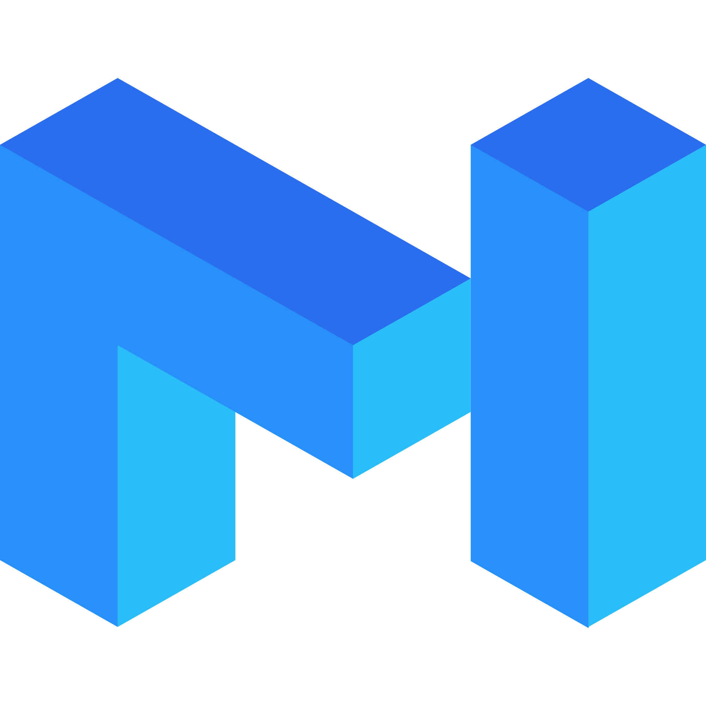
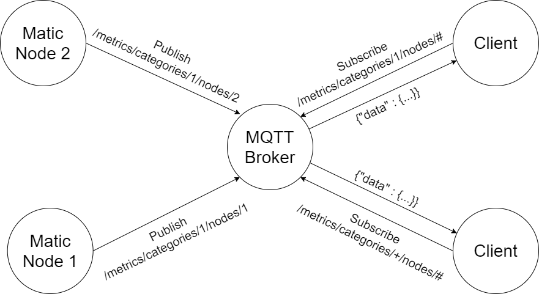
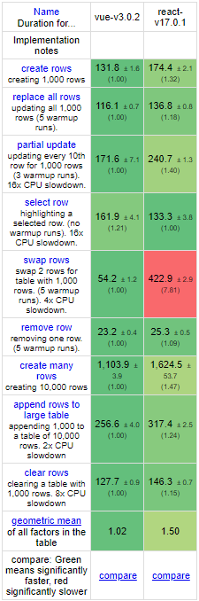
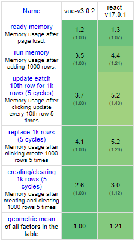
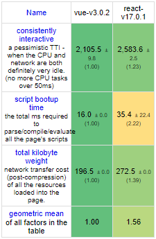

Matic Telemetry Proposal
======================

[Matic Network](https://matic.network/) brings massive scale to Ethereum using an adapted version of Plasma with PoS based side chains.
This repository contains the Matic Telemetry, which makes it possible to receive event-based information about the running nodes. 
These metrics can be subscribed by any front-end and displayed accordingly in the UI.

## Table of Contents
- [Matic Telemetry Proposal](#matic-telemetry-proposal)
  - [Table of Contents](#table-of-contents)
  - [Architecture](#architecture)
    - [MQTT](#mqtt)
      - [General](#general)
      - [Example](#example)
  - [Implementation](#implementation)
    - [Broker](#broker)
    - [Matic Nodes](#matic-nodes)
    - [Clients](#clients)
    - [Performance](#performance)
      - [Matic Node](#matic-node)
      - [MQTT Broker](#mqtt-broker)
        - [Horizontal scalability](#horizontal-scalability)
      - [Client](#client)
  - [Schedule](#schedule)
  - [Links](#links)

## Architecture
The architecture of this project is designed to be relatively simple. Metrics are sent to a central instance using a publish-subscribe mechanism. These metrics can then be retrieved by various clients. There are three main actors: 
- The matic nodes, which publish the data
- The broker, which receives the data from matic nodes and sends it to clients
- The clients, who can view the data, e.g. using a web application that can be accessed via a separate web server

### MQTT

#### General

[MQTT](https://mqtt.org/) is an OASIS standard messaging protocol for the Internet of Things (IoT). It is designed as an extremely lightweight publish/subscribe messaging transport that is ideal for connecting remote devices with a small code footprint and minimal network bandwidth. MQTT today is used in a wide variety of industries, such as automotive, manufacturing, telecommunications, oil and gas, etc..

We have several Matic nodes that publish their metrics with a specified topic. These topics can be subscribed by different clients and displayed accordingly, for example in the web UI. The broker ensures that the messages from the different topics are forwarded to the corresponding clients.

#### Example

In the following example we have two matic nodes. Each of these nodes **must** have a unique ID and **can** be assigned to a category. The categories could consist of the different types of nodes, for example "Bor", "Heimdall service", "Heimdall bridge", "REST server", etc.. The client can then prefilter the topics in the web interface and thus only the necessary data is transferred from the broker to the client. 
Using the wildcards "+" and "#" you can also subscribe to all categories and/or nodes.

## Implementation
Since we use different components and a standardized protocol here, we can also use different programming languages.

### Broker
Since I know the object-oriented programming language C# best, I will use the [.NET](https://dotnet.microsoft.com/) framework for the broker. Especially with .NET 5 we have here a cross-platform framework that is quite performant and readable. The syntax is similar to the Java programming language. For MQTT we will use the library [MQTTNet](https://github.com/chkr1011/MQTTnet).

This way we can always display a list of connected clients.

### Matic Nodes
Since the Matic nodes are written in the Golang programming language, it is recommended to use the [Eclipse Paho MQTT Go client](https://github.com/eclipse/paho.mqtt.golang) library for MQTT.
When the nodes are being started, the argument `--telemetry` should be used to automatically start the telemetry to the broker.
The following metrics should generally be transmitted in the form of JSON using MQTT:
- Current Software Version
- Block # & Block Hash
- Block Time
- Block Propagation time

Based on the active connection to the broker and the specified topic, additional parameters are obtained:
- Peers Connected #
- Bor Service (Active or not)
- Heimdall service (Active or not)
- Rest-Server (Active or not)
- Heimdall Bridge (Active or not)

These lists may be expanded in the future.

### Clients
A user should be able to access a dashboard via a browser that connects to the broker and then displays the metrics in the form of a table. The whole dashboard should be visually appealing and user-friendly.
For simplicity, the popular JavaScript framework [Vue.js](https://vuejs.org/) Framework is used, which is both performant and easy to use. In addition, it makes sense to use the [Vue-Mqtt](https://github.com/nik-zp/Vue-Mqtt) library for MQTT. 

### Performance

#### Matic Node

Since MQTT is a lightweight protocol the sent data is very small, the performance of the node is almost not affected at all and can be adjusted by slower update rates if necessary.

#### MQTT Broker

##### Horizontal scalability
An MQTT broker does not have to consist of only one server, but can also be a **cluster of different servers**. This possibility of scaling is already provided with some MQTT libraries, for example [MQTTNet](https://github.com/SeppPenner/NetCoreMQTTExampleCluster).
Nevertheless, a single broker should be sufficient for most cases. According to MQTTNet, this library can process up to **70k messages per second** (Intel i7 8700K). At this point, the Matic network consists of **82 active nodes** and with this information, the nodes could therefore each send up to around **853 updates per second** until the broker is fully utilized.

#### Client

If you look at the [JS Framework Benchmark](https://krausest.github.io/js-framework-benchmark/current.html), you will see that Vue.js performs even better than React.js in most categories. The performance for adjusting the table rows plays an important role and should be sufficient for our use case.

## Schedule

Implementing the UI and broker will probably take around one week to get a first beta release. The Golang implementation could possibly be done by a Matic node developer, but code snippets would be provided by me. It's just a matter of creating the argument `--telemetry` and a scheduled task that sends the metrics to a specified broker with the defined topic in regular time intervals.
If necessary, I can deal with the programming language Golang and the implementation of the nodes myself, although this would not be optimal in terms of time.

## Links

* [Matic Network](https://matic.network/)
* [MQTT](https://mqtt.org/)
* [MQTTNet](https://github.com/chkr1011/MQTTnet)
* [Vue-Mqtt](https://github.com/nik-zp/Vue-Mqtt)
* [Eclipse Paho MQTT Go client](https://github.com/eclipse/paho.mqtt.golang)
* [GitHub Repo](https://github.com/sean-mcl/matic-telemetry)
* [JS Framework Benchmark](https://krausest.github.io/js-framework-benchmark/current.html)
